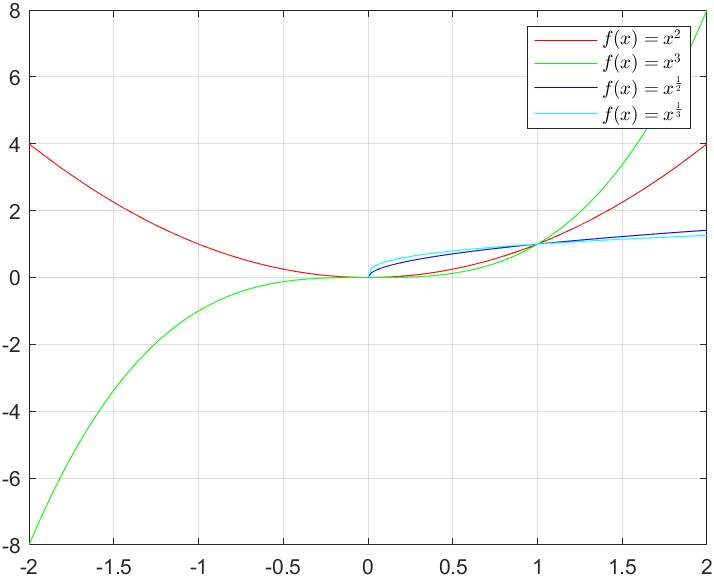

# 幂函数

幂函数（英语：Power function）是形如 $f(x)=x^{a}$ 的函数，a 可以是自然数、有理数，也可以是任意实数或复数。

## 定义及法则

$b^0=1,b\in\mathbb{R}_{\neq0}$

$b^{-n}=\frac{1}{b^{n}},b\in\mathbb{R}_{\neq0},n\in\mathbb{Q}$

$b^{\frac{1}{n}}=\sqrt[n]{b},b\in\mathbb{R}_{\geq0},n\in\mathbb{Z}_{>0}$ （b<0 且 n 为偶数时有复数值，这样的值无法讨论）

$b^{m+n}=b^m \cdot b^n,b\in\mathbb{R}_{\neq0},m\in\mathbb{Q},n\in\mathbb{Q}$

$(b^{m})^n=b^{mn},b\in\mathbb{R}_{\neq0},m\in\mathbb{Q},n\in\mathbb{Q}$

$(b \cdot c)^{n}=b^n \cdot c^n,b\in\mathbb{R}_{\neq0},m\in\mathbb{Q},n\in\mathbb{Q}$

## 图像

## 相关证明

### 整数指数

#### 正整指数

当 $b\in\mathbb{R}_{\neq0},m\in\mathbb{Z}_{>0},n>\mathbb{Z}_{>0}$ 显然有：

$b^{m+n}=b^m \cdot b^n$

$(b^{m})^n=b^{mn}$

$(b \cdot c)^{n}=b^n \cdot c^n$

#### 零指数

**定义** $b^0=1,b\in\mathbb{R}_{\neq0}$ 的原因是：

扩展 $b^{m+n}=b^m \cdot b^n,b\in\mathbb{R}_{\neq0},m\in\mathbb{Z}_{>0},n>\mathbb{Z}_{>0}$ ，将 m,n 扩展到可以等于 0。$b^{0+n}=b^0 \cdot b^n$ ，可得 $b^0=1$ 。

#### 负整指数

**定义** $b^{-n}=\frac{1}{b^{n}},b\in\mathbb{R}_{\neq0},n\in\mathbb{Z}_{\neq0}$ 的原因是：

扩展 $b^{m+n}=b^m \cdot b^n,b\in\mathbb{R}_{\neq0},m\in\mathbb{Z}_{>0},n>\mathbb{Z}_{>0}$ ，将 m,n 扩展到可以小于 0。$1=b^{-n+n}=b^{-n} \cdot b^{n}$ ，可得 $b^{-n}=\frac{1}{b^{n}}$ 。

### 有理数指数

定义当 $b\in\mathbb{R}_{\geq0},n\in\mathbb{Z}_{\>0}$ 时， $b^{\frac{1}{n}}=\sqrt[n]{b}$。
