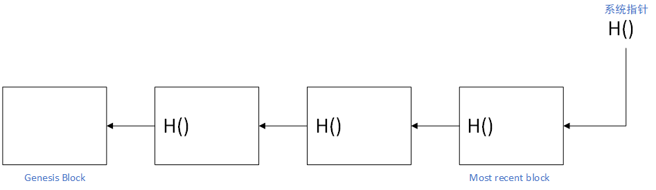
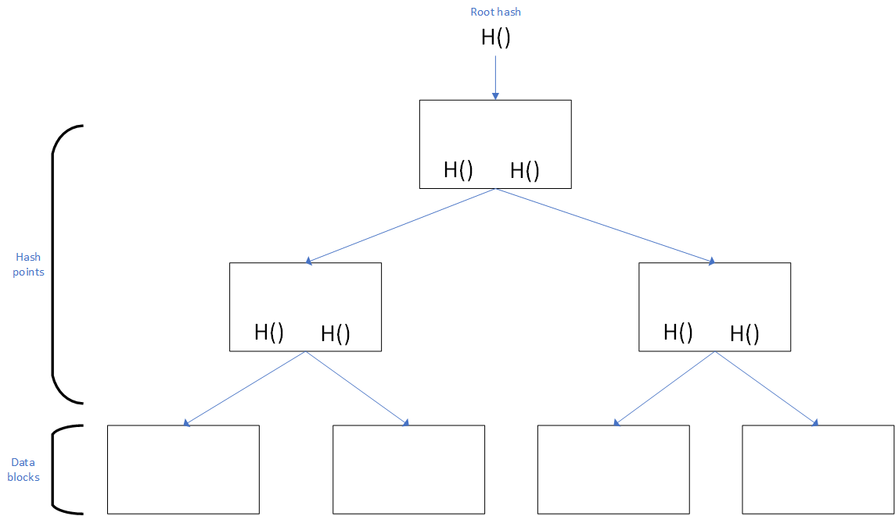

# 区块链

## 数据结构

### hash 指针链表

哈希指针：指针除了保存结构体的地址，还保存结构体的 hash 。好处是可以知道结构体有没有被修改。

区块链是一个链表：用哈希指针代替普通指针。

区块链中每一个区块都有一个指向前一个区块的 hash 指针。

基于这样的结构，就可以实现**tamper evident log**，通过指针值就可以知道前面的某个块是否有变化。

通过这个性质，区块链的用户节点无需保存整条区块链，而可以只保存最近的部分区块链。

### merkle tree

默克尔树是使用哈希指针的二叉树。

通过根 hash 值，就可以知道整棵树有没有修改。

如果已有根 hash 值，要证明一个 data 块在默克尔树中，只需要获取这个块的位置到根节点的路径上相关的 hash 值，而无需获取整棵树。这种证明被称为 merkle proof。这种证明存在被称为 proof of membership 或 proof of inclusion。

对于比特币，每个区块对应一棵默克尔树，块头(block header)中保存了默克尔树的根指针，块体(block body)中保存了默克尔树。默克尔树的每个 data 块表示一个交易。

比特币节点分为两种：全节点和轻节点。轻节点只保存块头。轻节点在校验交易是否被写入时，利用 merkle proof，只需请求 data 块到根节点路径上的 hash 值，而无需请求整棵树。

---

有没有可能通过人为制造 hash 碰撞，伪造 data 块和相邻的 hash？

答：根据 hash 函数 Collision resistance 的特性，这是不可能的。

#### sorted merkle tree

将 data 块按 hash 值排序，这种 merkle tree 称为 sorted merkle tree 。

如果要证明一个 data 块不在 sorted merkle tree 中，只需要得到 data 块应该所在的位置，然后计算这个块到根节点路径的相关 hash 值即可。这种不存在证明称为 proof of non-membership。

---

关于哈希指针的思考：任何无环链都可以使用哈希指针。
