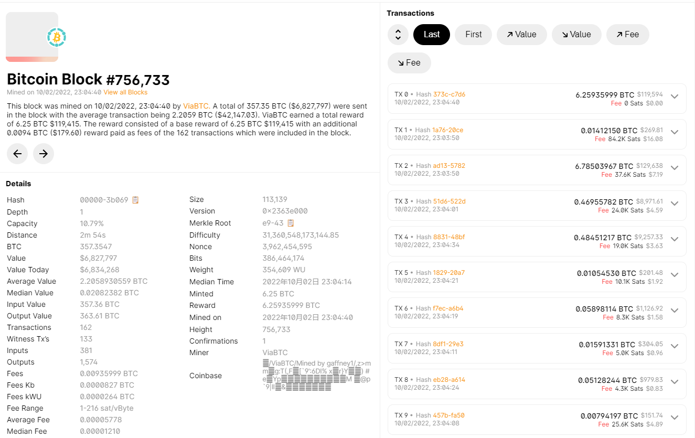

# 区块链

## 数据结构

### hash 指针链表

哈希指针：指针除了保存结构体的地址，还保存结构体的 hash 。好处是可以知道结构体有没有被修改。

区块链是一个链表：用哈希指针代替普通指针。

区块链中每一个区块都有一个指向前一个区块的 hash 指针。

基于这样的结构，就可以实现**tamper evident log**，通过指针值就可以知道前面的某个块是否有变化。

通过这个性质，区块链的用户节点无需保存整条区块链，而可以只保存最近的部分区块链。

### merkle tree

默克尔树是使用哈希指针的二叉树。

通过根 hash 值，就可以知道整棵树有没有修改。

如果已有根 hash 值，要证明一个 data 块在默克尔树中，只需要获取这个块的位置到根节点的路径上相关的 hash 值，而无需获取整棵树。这种证明被称为 merkle proof。这种证明存在被称为 proof of membership 或 proof of inclusion。

对于比特币，每个区块对应一棵默克尔树，块头(block header)中保存了默克尔树的根指针，块体(block body)中保存了默克尔树。默克尔树的每个 data 块表示一个交易。

比特币节点分为两种：全节点和轻节点。轻节点只保存块头。轻节点在校验交易是否被写入时，利用 merkle proof，只需请求 data 块到根节点路径上的 hash 值，而无需请求整棵树。

---

有没有可能通过人为制造 hash 碰撞，伪造 data 块和相邻的 hash？

答：根据 hash 函数 Collision resistance 的特性，这是不可能的。

#### sorted merkle tree

将 data 块按 hash 值排序，这种 merkle tree 称为 sorted merkle tree 。

如果要证明一个 data 块不在 sorted merkle tree 中，只需要得到 data 块应该所在的位置，然后计算这个块到根节点路径的相关 hash 值即可。这种不存在证明称为 proof of non-membership。

---

关于哈希指针的思考：任何无环链都可以使用哈希指针。

## BTC 协议

### 从中心化数字货币开始

首先考虑中心化的情况，由央行发行数字货币，每个货币由央行进行签名。交易时用央行的公钥进行验证。

这种机制的问题是，每个货币实际是一个文件，导致货币是可以复制的，每个货币可以多次被花费。这种攻击被成为**花两次攻击（double speeding attack）**。

解决问题的方案是需要在中心化的央行进行记账。为每个数字货币编号，记录每个数字货币在谁的手里，每次花费都要去央行验证。

---

数字货币要解决两个主要的问题：

1. 如何决定货币的发行。
2. 如何验证交易的有效性。

### BTC 中交易的有效性

#### 比特币如何记录交易

在比特币系统中，每个交易都包含输入和输出，输入要说明币的来源；输出要说明收款人的地址。并且交易要由付款人签名。（收款人地址由公钥生成）

有了币了来源，就防止了 double speeding。

下图是简化的区块链，仅给出 merkle tree 中的一个交易：

在一次交易记录中，需要知道付款人的公钥，因为需要验证付款人的签名。付款人的公钥由付款人自己在交易中提供。

有没有可能有人伪造付款人的密钥，用伪造的私钥签名，交易时给出伪造的公钥？这是不可能的，因为付款人的公钥必须和币来源的公钥（前面交易的收款人的地址）相匹配。

#### 分布式共识

每个区块链节点必须取得一致性，这叫做**分布式共识（distributed consensus）**。

##### 分布式共识理论

> [FLP impossibility result](<https://en.wikipedia.org/wiki/Consensus_(computer_science)#The_FLP_impossibility_result_for_asynchronous_deterministic_consensus>)
>
> 在异步系统中，即使只有一个成员有问题，也不可能取得共识。

> [CAP theorem](https://zh.wikipedia.org/wiki/CAP%E5%AE%9A%E7%90%86)
>
> 一个分布式系统中，不可能同时满足：一致性（Consistency），可用性（Availability），分区容错性（Partition tolerance）。

##### BTC 的分布式共识

一种取得共识的方式是投票：一个节点提出一个区块，由大家投票是否接受设个区块。

投票的一个问题是哪些成员（member）由投票权。

一种方式是按账号投票，这种方式的问题是有人不断生成账号，从而取得更大的投票权，这种攻击成为**女巫攻击（sybil attack）**。

---

BTC 的投票不按账号投票，而是按算力投票。

比特币中每个节点都可以提出区块，提出区块需要寻找新区块中符合条件的 nonce。如果找到区块就说这个节点取得了**记账权**。

寻找 nonce 的过程是 **puzzle friendly** 的，也就是说，算力和获得记账权的概率是成比例的。

---

某个节点提出区块后，首先检查区块是否合法（target 难度、其中包含的交易全部合法、nonce 等）。

之后，要确定区块是否插在**最长合法链**上。而不能插在区块链的中间位置。插在区块链中间的攻击被称为**分叉攻击（forking attack）**。

如果两个区块同时取得了记账权，每个节点会接受最早收到的区块。也就是说，两个新块可能会在分布式系统中同时存在，维持一段时间，两个区块会进行竞争，最终会有一个胜出。

---

如果一个块中的交易产生了不可逆的外部影响，但是另外一个节点在中间插入了一个区块，并成为了最长合法链，这是不可接受的。

BTC 解决这个问题的方式是多等几个 confirmation，这样修改最长合法链的难度就会大大增加。一般将交易所在的块称为 one confirmation，交易后面一个块称为 two confirmation，以此类推。BTC 缺省要等待 six confirmation。

在实际应用中，甚至在 zero confirmation 就使交易生效，因为外部影响通常在时间范围内是可逆的（例如网购还未发货）。

---

有一种恶意节点，对挖出的区块不发布，而是继续往后挖，等待时机一次性发布多个区块，达到修改最长合法链的目的。这种攻击被称为**selfish mining**。

这种攻击只有在恶意节点占据很大的算力时才有较大的成功可能性。

### BTC 的发行

BTC 节点努力寻找新块获得记账权的原因是，可以获得**出块奖励（block reward）**。新块中可以插入一个产生新币的交易，称为**铸币交易（boinbase transaction）**。

BTC 的出块奖励从 50BTC 开始，每过 21 万个区块减半。BTC 约十分钟出一个区块，减半时间大约为四年。比特币总量为：$50+25+12.5+...=50*(1+1/2+1/4+...)=2100W$。

## BTC 实现

### 基于交易的账本

BTC 是基于交易的账本（transaction-based ledger）。

BTC 的全节点需要在内存中维护 **UTXO（Unspent Transaction Output）**，记录未被花费的交易的输出。UTXO 包含交易的哈希值及输出是交易中的第几个输出。UTXO 被用来校验交易来源的合法。

每次交易的 input 可能大于 output，用于**交易费（transaction fee）**。

另外一种账本模式是基于账户的账本（account-based ledger）。系统需要显式记录每个账号上有多少币。ETH 即采用的这种模式。

### BTC 区块组成

BTC 中区块的组成：

- block header
  - version：版本
  - hash of previous block header：前一个块块头的 hash
  - merkle root hash：默克尔树的根 hash
  - target：难度阈值参数
  - nonce：挖矿值
- block body
  - transaction：交易详情（默克尔树）

下面是一个区块示例：（<https://www.blockchain.com/explorer/blocks/btc/756733>）

nonce 是一个 32 位整型，可能找完全部仍然找不到符合要求的值。在铸币交易中，有一个 CoinBase，可以写入任何内容，修改了 CoinBase，也就修改了 merkle root hash。

### 寻找新块的概率

每次尝试 nonce 的过程可以看作一个[伯努利试验（Bernoulli trial）](https://zh.wikipedia.org/wiki/%E4%BC%AF%E5%8A%AA%E5%88%A9%E8%A9%A6%E9%A9%97)。寻找新块的一系列尝试可以构成一个[伯努利过程](https://zh.wikipedia.org/wiki/%E4%BC%AF%E5%8A%AA%E5%88%A9%E8%BF%87%E7%A8%8B)。

由于伯努利过程的**无记忆性(memoryless)**，现在这一次尝试的成功率和过去尝试了多少次无关。过去挖矿多长时间与未来还需要挖多长时间无关，这保障了挖矿的公平性。

当数量很多，伯努利过程可以使用[泊松过程](https://zh.wikipedia.org/wiki/%E6%B3%8A%E6%9D%BE%E8%BF%87%E7%A8%8B)近似。

出块概率与出块时间呈指数关系。BCT 会调整难度使出块时间维持在 10 分钟左右。

---
