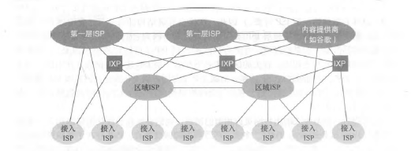

# 读书记录-计算机网络-自顶向下方法

## 1.计算机网络和因特网

### 1.1.什么是因特网

#### 1.1.1.具体构成描述

【硬件描述】

计算机设备称作**主机**或**端系统**，它们组成的网络称作*计算机网络*，世界范围内的计算机网络即*因特网*。

端系统通过**通信链路**和**分组交换机**连接到一起。

链路的**传输速率**以比特/秒（bit/s）度量。

当端系统向另一台端系统发送数据时，发送端系统将数据分段，并为每段加上首部字节，由此形成的信息包称作**分组**。

最著名的分组交换机类型是**路由器**和**分组交换机**。（TODO:路由和分组交换机的区别）。

一个分组所经历的一系列通信链路和分组交换机成为通过该网络的**路径**。

端系统通过**ISP**（Internet Service Provider，因特网提供商）接入因特网。

端系统、分组交换机和其他因特网部件都要运行一系列**协议**。

**TCP**和**IP**是因特网中两个最重要的协议。

**因特网标准**由 IETF 研发，其标准文档成为**请求评论**。

#### 1.1.2.服务描述

【软件描述】

涉及多个相互交换数据的端系统的应用程序，称作**分布式程序**。

```
因特网应用程序运行在端系统上，分组交换机不在意作为数据源或宿的应用程序。
```

与因特网相连的端系统提供了一个**套接字接口**，该接口规定了因特网上一个端系统上的程序向另一个端系统上的程序交付数据的方式。

#### 1.1.3.什么是协议

**协议**定义了在两个或多个通信实体之间交换的报文的格式和顺序，以及报文发送或接受一条报文或其他事件所采取的动作。

```
为了完成一项工作，多个通信实体必须运行相同的协议。
```

### 1.2.网络边缘

【端系统位于网络边缘】

主机有时被分为两类：**客户**和**服务器**。

#### 1.2.1.接入网

**接入网**指将端系统物理连接到其**边缘路由器**的网络。边缘路由器指端系统到其他远程端系统路径上的第一台路由器。

- 家庭接入：DSL、电缆、FTTH、拨号和卫星。
  - **DSL**：数字用户线。
    - 复用了现有的电话基础设施。使用 DSL 时，电话公司也是它的 ISP。
    - 需要 DSL 调制解调器。
  - **电缆因特网接入**。
    - 复用了有线电视的基础设施。
    - 需要电缆调制解调器。
    - 电缆因特网接入的一个重要特征是共享广播媒体。
  - **FTTH**：光纤到户。
    - 可以从本地中心局到每户设置一根光纤。
    - 更为一般的是多户共享一根光纤。分布体系有两种：主动光纤网络（AON）和被动光纤网络（PON）。
      - 被动光纤网络：每个家庭具有一个[光纤网络端接器（ONT）（即光调制解调器，光猫）](https://baike.baidu.com/item/%E5%85%89%E8%B0%83%E5%88%B6%E8%A7%A3%E8%B0%83%E5%99%A8/9455758)，连接到光纤分配器集结到一根光纤，连接到光纤线路端接器（OLT），OLT 将光信号转换为电信号，与因特网相连。如图。
      - 主动光纤网络本质上就是交换因特网。
  - **卫星链路**可在偏远地区使用。
  - **拨号网络**：用户经电话线连接到 ISP 的调制解调器。
- 企业接入：以太网和 WIFI。
  - **以太网**：使用**局域网（LAN）**将端系统连接到边缘路由器。
  - 基于 IEEE802.11 技术的无限 LAN 接入通俗地成为**WIFI**。
- 广域无线接入：3G 和 LTE。

#### 1.2.2.物理媒体

**物理媒体**通过电磁波或光脉冲等发送比特。

物理媒体分为两种类型：

- **引导型媒体**，电波沿着固体媒体前行。
- **非引导型媒体**，电波在空气或外层空间中传播。

常见物理媒体：

- **双绞铜线**。**无屏蔽双绞线**常用于局域网。
- **同轴电缆**。通常被用作**共享媒体**。
- **光纤**。通常被用作长途传输媒体。
- **陆地无线电通信**。分为三类：短距离，1-2 米；中距离，10-100 米；远距离，远至数万米。
- **卫星无线电通信**。通常使用两种卫星：**同步卫星**和**近地轨道卫星**。

### 1.3.网络核心

【交换机和链路位于网络核心】

#### 1.3.1.分组交换

【分组交换是因特网采用的交换形式】

端系统彼此交换**报文**，报文包含控制功能或数据。源将报文划分为较小的数据款，称作**分组**。在源和目的地之间，每个分组都通过**链路**和**分组交换机**。

##### 1. 存储转发传输

**存储转发传输**是指在交换机能够开始向输出链路传输该分组的第一个比特之前，必须接收到整个分组。

从源到目的地发送一个分组，分组长度为 L，通过 N 条速度均为 R 的链路组成的路径，端到端时延是：$d_{端到端}=N\frac{L}{R}$ 。

##### 2.排队时延和分组丢失

分组交换机具有一个**输出缓存**（或**输出队列**），用于存储准备发往的那条链路的分组。如果链路正在忙于传输其他分组，到达分组必须在输出缓存中等待，称为**排队时延**。因为缓存空间大小有限，如果到达分组到来时发现缓存已满，这时会出现**分组丢失**（**丢包**）。

##### 3. 转发表和路由选择协议

每个端系统具有一个 IP 地址。IP 地址具有一种等级结构，当分组到达路由器时，路由器检查目的地址的一部分，并向相邻路由器转发该分组。

每台路由器具有一个**转发表**，用于将目的地址（或目的地址的一部分）映射为输出链路。因特网使用一些特殊的**路由选择协议**，自动地设置转发表。

#### 1.3.2.电路交换

【电路交换是因特网未采用的交换形式】

电路交换预留了端系统间沿路径通信所需要的资源；而分组交换是不预留的。

电路交换中，沿着发送方和接收方之间路径上的交换机都将为该连接维护连接状态，该连接成为一条**电路**，这是一个名副其实的连接，是两台主机专用的**端到端连接**。

##### 1·电路交换网络中的复用

链路中的电路是通过**频分复用**（FDM）或**时分复用**（TDM）来实现。

- 频分复用中，连接期间为每条连接专用一个频段。该频段宽度成为**带宽**。
- 时分复用中，时间被划分为固定长度的帧，每个帧又被划分为固定数量的时隙，连接期间该连接专用一个时隙。

分组交换因存在**静默期**（维持连接但没有传输数据），所以不够经济。

##### 2.分组交换与电路交换的对比

1. 分组交换提供了比电路交换更好的带宽共享。
2. 分组交换比电路交换更简单、更有效、实现成本更低。

#### 1.3.3.网络的网络

网络的网络，是为了解决 ISP 之间的互联问题。

1. 网络结构 1。
   - 用单一的全球传输 ISP 互联所有接入 ISP。此时接入 ISP 被认为是**客户**，全球 ISP 被认为是**提供商**。
2. 网络结构 2。
   - 网络结构 1 中可能有多个全球 ISP，这导致网络结构 2。
   - 由数十万接入 ISP 和多个全球 ISP 组成。
   - 多个全球 ISP 之间必须保证互联。
3. 网络结构 3。
   - 在特定区域，可能有**区域 ISP**，区域 ISP 与接入 ISP 连接，区域 ISP 又与**第一层 ISP**连接。
   - 区域 ISP 也可能有多层结构。
4. 网络结构 4。
   - 在网络结构 3 的基础上增加接入点（POP）、多宿、对等、互联网交换点。
   - **POP** 是提供商网络中的路由器群组，客户 ISP 可以与提供商 ISP 相连。
   - **多宿**：ISP 可以与多个 ISP 连接。
   - **对等**：相同层级的邻近 ISP 可以直接将它们的网络连接到一起，使它们的流量径直连接，而不是通过上游的中间 ISP 传输。
   - **因特网交换点**（IXP）：它是一个汇合点，多个 ISP 能够在这里一起对等。
5. 网络结构 5。
   - 在网络结构 4 顶部增加**内容提供商网络**。
   - 内容提供商网络一般经过专用的 TCP/IP 网络互连，独立于公共因特网。



### 1.4.分组交换中的时延、丢包、吞吐量

#### 1.4.1.分组交换中的时延概述

- **处理时延**。路由器对分组的处理时间，检查分组首部和决定将分组导向何处是处理时延的一部分。
- **排队时延**。在输出缓存中，分组在链路上等待传输的时间。
- **传输时延**。将所有分组的比特推向链路所需要的时间。用 L 表示分组长度，R 表示传输速率，传输时延是：$\frac{L}{R}$ 。
- **传播时延**。一个比特被推向链路后，从链路起点到下一个路由器所需要的时间。用 d 表示路由器之间的距离，s 表示链路的传播速率，传播时延是：$\frac{d}{s}$ 。

用 $d_{proc}$、$d_{queue}$、$d_{trans}$、$d_{prop}$ 分别表示 处理时延、排队时延、传输时延、传播时延，节点的总时延 $d_{nodal}=d_{proc}+d_{queue}+d_{trans}+d_{prop}$

#### 1.4.2.排队时延和丢包

用 a 表示分组到达队列的平均速率，L 表示每个分组的长度，R 表示传输速率 $La/R$ 称为**流量强度**。_设计系统时流量强度不能大于 1_，否则排队时延将趋向无穷大。随着流量强度接近 1，平均排队时间越来越长。

分组到达时，如果队列是满的，由于没有地方存储分组，路由器将**丢弃**该分组，该分组将会**丢失**。

#### 1.4.3.端到端时延

假设网络是无拥塞的（排队时延微不足道），在源主机和目的主机之间有 N-1 台路由器，那么端到端时延：$d_{end-end}=N(d_{proc}+d_{trans}+d_{prop})$ 。

#### 1.4.4.计算机网络中的吞吐量

假设主机 A 到主机 B 传输一个文件，主机 B 在任何时间瞬间接收文件的速率称作**瞬时吞吐量**。假设文件大小为 F，接收用去时间 T，那么**平均吞吐量**为 $F/T$ 。

考虑一条链路，$R_s$ 表示服务器与路由器之间的链路速率，$R_c$ 表示路由器与客户端的链路速率，那么这条链路的传输速率为 $\min\{R_s,R_c\}$，称为**瓶颈链路**传输速率。传输一个大小为 F 所需时间是 $F/\min\{R_s,R_c\}$ 。

如果许多数据沿着一条链路流动，那么其会相互干扰。吞吐量不仅取决于沿着路径的传输速率，而且取决于干扰流量。

### 1.5.协议层次及其服务模型

#### 1.5.1.分层的体系结构

##### 1.协议分层

网络设计者以**分层**的方式组织协议以及实现协议的硬件和软件。一层向它的上一层提供**服务**，即一层的**服务模型**。

各层的所有协议被称为**协议栈**。因特网的协议栈由五个层次组成：物理层、链路层、网络层、运输层、应用层。

- 应用层。应用层的信息分组称为**报文**。
- 运输层。运输层的分组称为**报文段**。TCP 提供了面向连接的服务；UDP 提供无连接服务。
- 网络层。网络层的分组称为**数据报**。网络层的协议有 IP 协议、路由选择协议等。
- 链路层。链路层的分组称为**帧**。链路层协议有以太网协议、WiFi 和电缆接入网的 DOCSIS 协议等。
- 物理层。物理层与实际传输媒体相关。

##### 2.OSI 模型

OSI 模型增加了表示层与会话层。

- 表示层的作用是使通信的应用程序能够解释交换数据的含义。
- 会话层提供了数据交换的定界和同步功能。

#### 1.5.2.封装

路由器和链路层交换机并不实现协议栈中所有的层次。

**封装**。在发送主机端，一个**应用层报文**被传送给运输层。应用层报文和运输层首部构成**运输层报文段**。运输层则向网络层传递报文段，网络层增加如源和目的端地址等网络层首部信息，生成**网络层数据报**。数据报传递给链路层，链路层增加链路层首部生成**链路层帧**。

在每一层，一个分组包含两种类型的字段：首部字段和**有效荷载字段**。有效荷载通常来自上一层的分组。

### 1.6.面对攻击的网络

##### 1.坏家伙能够经因特网将有害程序放入你的计算机中

网络中的数据包含**恶意软件**。

受害设备网络称为**僵尸网络**。

多数恶意软件是**自我复制**的。**病毒**是一种需要某种形式的用户交互来感染用户设备的恶意软件。**蠕虫**是一种无须任何明显的用户交互就能进入设备的恶意软件。

##### 2.坏家伙能够攻击服务器和网络基础设施

一种宽泛类型的安全性威胁成为**拒绝服务攻击**（DOS）。

- 弱点攻击。针对易受攻击的应用程序。
- 带宽泛洪。向目标主机发送大量分组，使链路拥塞。
- 连接泛洪。在目标主机中创建大量 TCP 连接。

**分布式 DOS**（DDOS），使用多个源攻击目标。

##### 3.坏家伙能嗅探分组

记录每个流经的分组副本的被动接收机成为**分组嗅探器**。

##### 4.坏家伙能够伪装成你信任的人

将具有虚假源地址的分组注入因特网的能力称为 **IP 哄骗**。

### 1.7.计算机网络和因特网的历史

## 2.应用层

### 2.1.1.应用层协议原理

#### 2.1.2.进程通信

#### 2.1.3.可供应用程序使用的运输服务

#### 2.1.4.因特网提供的运输服务

#### 2.1.5.应用层协议

#### 2.1.6.本书涉及的网络应用

### 2.2.Web 和 HTTP

#### 2.2.1.HTTP 概况

#### 2.2.2.非持续连接和持续连接

#### 2.2.3.HTTP 报文格式

#### 2.2.4.用户与服务器的交互 cookie

#### 2.2.5.Web 缓存

#### 2.2.6.条件 GET 方法

### 2.3.因特网中的电子邮件

#### 2.3.1.SMTP

#### 2.3.2.与 HTTP 的对比

#### 2.3.3.邮件报文格式

#### 2.3.4.邮件访问协议

### 2.4.

#### 2.4.1.DNS 提供的服务

#### 2.4.2.DNS 工作机理概述

#### 2.4.3.DNS 记录和报文

### 2.5.

### 2.6.视频流和内容分发网

#### 2.6.1.因特网视频

#### 2.6.2.HTTP 流和 DASH

#### 2.6.3.内容分发网

#### 2.6.4.学习案例：Netflix、YouTube

### 2.7.套接字编程：生成网络应用

#### 2.7.1.UDP 套接字编程

#### 2.7.2.TCP 套接字编程
