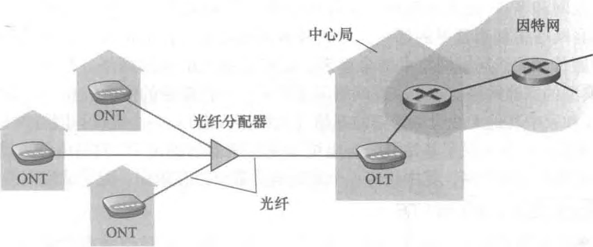

# 读书记录-计算机网络-自顶向下方法

## 1.计算机网络和因特网

### 1.1.什么是因特网

#### 1.1.1.具体构成描述

【硬件描述】

计算机设备称作**主机**或**端系统**，它们组成的网络称作*计算机网络*，世界范围内的计算机网络即*因特网*。

端系统通过**通信链路**和**分组交换机**连接到一起。

链路的**传输速率**以比特/秒（bit/s）度量。

当端系统向另一台端系统发送数据时，发送端系统将数据分段，并为每段加上首部字节，由此形成的信息包称作**分组**。

最著名的分组交换机类型是**路由器**和**分组交换机**。（TODO:路由和分组交换机的区别）。

一个分组所经历的一系列通信链路和分组交换机成为通过该网络的**路径**。

端系统通过**ISP**（Internet Service Provider，因特网提供商）接入因特网。

端系统、分组交换机和其他因特网部件都要运行一系列**协议**。

**TCP**和**IP**是因特网中两个最重要的协议。

**因特网标准**由 IETF 研发，其标准文档成为**请求评论**。

#### 1.1.2.服务描述

【软件描述】

涉及多个相互交换数据的端系统的应用程序，称作**分布式程序**。

```
因特网应用程序运行在端系统上，分组交换机不在意作为数据源或宿的应用程序。
```

与因特网相连的端系统提供了一个**套接字接口**，该接口规定了因特网上一个端系统上的程序向另一个端系统上的程序交付数据的方式。

#### 1.1.3.什么是协议

**协议**定义了在两个或多个通信实体之间交换的报文的格式和顺序，以及报文发送或接受一条报文或其他事件所采取的动作。

```
为了完成一项工作，多个通信实体必须运行相同的协议。
```

### 1.2.网络边缘

【端系统位于网络边缘】

主机有时被分为两类：**客户**和**服务器**。

#### 1.2.1.接入网

**接入网**指将端系统物理连接到其**边缘路由器**的网络。边缘路由器指端系统到其他远程端系统路径上的第一台路由器。

- 家庭接入：DSL、电缆、FTTH、拨号和卫星。
  - **DSL**：数字用户线。
    - 复用了现有的电话基础设施。使用 DSL 时，电话公司也是它的 ISP。
    - 需要 DSL 调制解调器。
  - **电缆因特网接入**。
    - 复用了有线电视的基础设施。
    - 需要电缆调制解调器。
    - 电缆因特网接入的一个重要特征是共享广播媒体。
  - **FTTH**：光纤到户。
    - 可以从本地中心局到每户设置一根光纤。
    - 更为一般的是多户共享一根光纤。分布体系有两种：主动光纤网络（AON）和被动光纤网络（PON）。
      - 被动光纤网络：每个家庭具有一个[光纤网络端接器（ONT）](https://baike.baidu.com/item/%E5%85%89%E8%B0%83%E5%88%B6%E8%A7%A3%E8%B0%83%E5%99%A8/9455758)，连接到光纤分配器集结到一根光纤，连接到光纤线路端接器（OLT），OLT 将光信号转换为电信号，与因特网相连。如图。
      - 主动光纤网络本质上就是交换因特网。
  - **卫星链路**可在偏远地区使用。
  - **拨号网络**：用户经电话线连接到 ISP 的调制解调器。
- 企业接入：以太网和 WIFI。
  - **以太网**：使用**局域网（LAN）**将端系统连接到边缘路由器。
  - 基于 IEEE802.11 技术的无限 LAN 接入通俗地成为**WIFI**。
- 广域无线接入：3G 和 LTE。

#### 1.2.2.物理媒体

### 1.3.网络核心

#### 1.3.1.分组交换

#### 1.3.2.电路交换

#### 1.3.3.网络的网络

### 1.4.分组交换中的时延、丢包、吞吐量

#### 1.4.1.分组交换中的时延概述

#### 1.4.2.排队时延和丢包

#### 1.4.3.端到端时延

### 1.5.协议层次及其服务模型

#### 1.5.1.分层的体系结构

#### 1.5.2.封装

### 1.6.面对攻击的网络

### 1.7.计算机网络和因特网的历史
