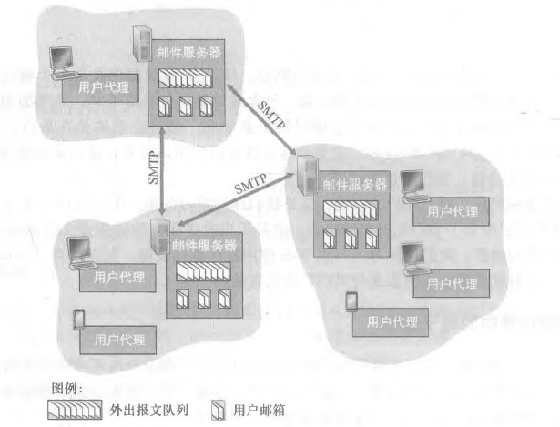
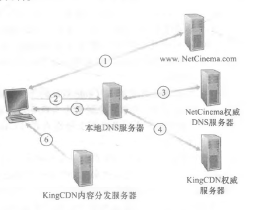

# 读书记录-计算机网络-自顶向下方法

## 1.计算机网络和因特网

### 1.1.什么是因特网

#### 1.1.1.具体构成描述

【硬件描述】

计算机设备称作**主机**或**端系统**，它们组成的网络称作*计算机网络*，世界范围内的计算机网络即*因特网*。

端系统通过**通信链路**和**分组交换机**连接到一起。

链路的**传输速率**以比特/秒（bit/s）度量。

当端系统向另一台端系统发送数据时，发送端系统将数据分段，并为每段加上首部字节，由此形成的信息包称作**分组**。

最著名的分组交换机类型是**路由器**和**分组交换机**。（TODO:路由和分组交换机的区别）。

一个分组所经历的一系列通信链路和分组交换机成为通过该网络的**路径**。

端系统通过**ISP**（Internet Service Provider，因特网提供商）接入因特网。

端系统、分组交换机和其他因特网部件都要运行一系列**协议**。

**TCP**和**IP**是因特网中两个最重要的协议。

**因特网标准**由 IETF 研发，其标准文档成为**请求评论**。

#### 1.1.2.服务描述

【软件描述】

涉及多个相互交换数据的端系统的应用程序，称作**分布式程序**。

```
因特网应用程序运行在端系统上，分组交换机不在意作为数据源或宿的应用程序。
```

与因特网相连的端系统提供了一个**套接字接口**，该接口规定了因特网上一个端系统上的程序向另一个端系统上的程序交付数据的方式。

#### 1.1.3.什么是协议

**协议**定义了在两个或多个通信实体之间交换的报文的格式和顺序，以及报文发送或接受一条报文或其他事件所采取的动作。

```
为了完成一项工作，多个通信实体必须运行相同的协议。
```

### 1.2.网络边缘

【端系统位于网络边缘】

主机有时被分为两类：**客户**和**服务器**。

#### 1.2.1.接入网

**接入网**指将端系统物理连接到其**边缘路由器**的网络。边缘路由器指端系统到其他远程端系统路径上的第一台路由器。

- 家庭接入：DSL、电缆、FTTH、拨号和卫星。
  - **DSL**：数字用户线。
    - 复用了现有的电话基础设施。使用 DSL 时，电话公司也是它的 ISP。
    - 需要 DSL 调制解调器。
  - **电缆因特网接入**。
    - 复用了有线电视的基础设施。
    - 需要电缆调制解调器。
    - 电缆因特网接入的一个重要特征是共享广播媒体。
  - **FTTH**：光纤到户。
    - 可以从本地中心局到每户设置一根光纤。
    - 更为一般的是多户共享一根光纤。分布体系有两种：主动光纤网络（AON）和被动光纤网络（PON）。
      - 被动光纤网络：每个家庭具有一个[光纤网络端接器（ONT）（即光调制解调器，光猫）](https://baike.baidu.com/item/%E5%85%89%E8%B0%83%E5%88%B6%E8%A7%A3%E8%B0%83%E5%99%A8/9455758)，连接到光纤分配器集结到一根光纤，连接到光纤线路端接器（OLT），OLT 将光信号转换为电信号，与因特网相连。如图。
      - 主动光纤网络本质上就是交换因特网。
  - **卫星链路**可在偏远地区使用。
  - **拨号网络**：用户经电话线连接到 ISP 的调制解调器。
- 企业接入：以太网和 WIFI。
  - **以太网**：使用**局域网（LAN）**将端系统连接到边缘路由器。
  - 基于 IEEE802.11 技术的无限 LAN 接入通俗地成为**WIFI**。
- 广域无线接入：3G 和 LTE。

#### 1.2.2.物理媒体

**物理媒体**通过电磁波或光脉冲等发送比特。

物理媒体分为两种类型：

- **引导型媒体**，电波沿着固体媒体前行。
- **非引导型媒体**，电波在空气或外层空间中传播。

常见物理媒体：

- **双绞铜线**。**无屏蔽双绞线**常用于局域网。
- **同轴电缆**。通常被用作**共享媒体**。
- **光纤**。通常被用作长途传输媒体。
- **陆地无线电通信**。分为三类：短距离，1-2 米；中距离，10-100 米；远距离，远至数万米。
- **卫星无线电通信**。通常使用两种卫星：**同步卫星**和**近地轨道卫星**。

### 1.3.网络核心

【交换机和链路位于网络核心】

#### 1.3.1.分组交换

【分组交换是因特网采用的交换形式】

端系统彼此交换**报文**，报文包含控制功能或数据。源将报文划分为较小的数据款，称作**分组**。在源和目的地之间，每个分组都通过**链路**和**分组交换机**。

##### 1. 存储转发传输

**存储转发传输**是指在交换机能够开始向输出链路传输该分组的第一个比特之前，必须接收到整个分组。

从源到目的地发送一个分组，分组长度为 L，通过 N 条速度均为 R 的链路组成的路径，端到端时延是：$d_{端到端}=N\frac{L}{R}$ 。

##### 2.排队时延和分组丢失

分组交换机具有一个**输出缓存**（或**输出队列**），用于存储准备发往的那条链路的分组。如果链路正在忙于传输其他分组，到达分组必须在输出缓存中等待，称为**排队时延**。因为缓存空间大小有限，如果到达分组到来时发现缓存已满，这时会出现**分组丢失**（**丢包**）。

##### 3. 转发表和路由选择协议

每个端系统具有一个 IP 地址。IP 地址具有一种等级结构，当分组到达路由器时，路由器检查目的地址的一部分，并向相邻路由器转发该分组。

每台路由器具有一个**转发表**，用于将目的地址（或目的地址的一部分）映射为输出链路。因特网使用一些特殊的**路由选择协议**，自动地设置转发表。

#### 1.3.2.电路交换

【电路交换是因特网未采用的交换形式】

电路交换预留了端系统间沿路径通信所需要的资源；而分组交换是不预留的。

电路交换中，沿着发送方和接收方之间路径上的交换机都将为该连接维护连接状态，该连接成为一条**电路**，这是一个名副其实的连接，是两台主机专用的**端到端连接**。

##### 1·电路交换网络中的复用

链路中的电路是通过**频分复用**（FDM）或**时分复用**（TDM）来实现。

- 频分复用中，连接期间为每条连接专用一个频段。该频段宽度成为**带宽**。
- 时分复用中，时间被划分为固定长度的帧，每个帧又被划分为固定数量的时隙，连接期间该连接专用一个时隙。

分组交换因存在**静默期**（维持连接但没有传输数据），所以不够经济。

##### 2.分组交换与电路交换的对比

1. 分组交换提供了比电路交换更好的带宽共享。
2. 分组交换比电路交换更简单、更有效、实现成本更低。

#### 1.3.3.网络的网络

网络的网络，是为了解决 ISP 之间的互联问题。

1. 网络结构 1。
   - 用单一的全球传输 ISP 互联所有接入 ISP。此时接入 ISP 被认为是**客户**，全球 ISP 被认为是**提供商**。
2. 网络结构 2。
   - 网络结构 1 中可能有多个全球 ISP，这导致网络结构 2。
   - 由数十万接入 ISP 和多个全球 ISP 组成。
   - 多个全球 ISP 之间必须保证互联。
3. 网络结构 3。
   - 在特定区域，可能有**区域 ISP**，区域 ISP 与接入 ISP 连接，区域 ISP 又与**第一层 ISP**连接。
   - 区域 ISP 也可能有多层结构。
4. 网络结构 4。
   - 在网络结构 3 的基础上增加接入点（POP）、多宿、对等、互联网交换点。
   - **POP** 是提供商网络中的路由器群组，客户 ISP 可以与提供商 ISP 相连。
   - **多宿**：ISP 可以与多个 ISP 连接。
   - **对等**：相同层级的邻近 ISP 可以直接将它们的网络连接到一起，使它们的流量径直连接，而不是通过上游的中间 ISP 传输。
   - **因特网交换点**（IXP）：它是一个汇合点，多个 ISP 能够在这里一起对等。
5. 网络结构 5。
   - 在网络结构 4 顶部增加**内容提供商网络**。
   - 内容提供商网络一般经过专用的 TCP/IP 网络互连，独立于公共因特网。


### 1.4.分组交换中的时延、丢包、吞吐量

#### 1.4.1.分组交换中的时延概述

- **处理时延**。路由器对分组的处理时间，检查分组首部和决定将分组导向何处是处理时延的一部分。
- **排队时延**。在输出缓存中，分组在链路上等待传输的时间。
- **传输时延**。将所有分组的比特推向链路所需要的时间。用 L 表示分组长度，R 表示传输速率，传输时延是：$\frac{L}{R}$ 。
- **传播时延**。一个比特被推向链路后，从链路起点到下一个路由器所需要的时间。用 d 表示路由器之间的距离，s 表示链路的传播速率，传播时延是：$\frac{d}{s}$ 。

用 $d_{proc}$、$d_{queue}$、$d_{trans}$、$d_{prop}$ 分别表示 处理时延、排队时延、传输时延、传播时延，节点的总时延 $d_{nodal}=d_{proc}+d_{queue}+d_{trans}+d_{prop}$

#### 1.4.2.排队时延和丢包

用 a 表示分组到达队列的平均速率，L 表示每个分组的长度，R 表示传输速率 $La/R$ 称为**流量强度**。_设计系统时流量强度不能大于 1_，否则排队时延将趋向无穷大。随着流量强度接近 1，平均排队时间越来越长。

分组到达时，如果队列是满的，由于没有地方存储分组，路由器将**丢弃**该分组，该分组将会**丢失**。

#### 1.4.3.端到端时延

假设网络是无拥塞的（排队时延微不足道），在源主机和目的主机之间有 N-1 台路由器，那么端到端时延：$d_{end-end}=N(d_{proc}+d_{trans}+d_{prop})$ 。

#### 1.4.4.计算机网络中的吞吐量

假设主机 A 到主机 B 传输一个文件，主机 B 在任何时间瞬间接收文件的速率称作**瞬时吞吐量**。假设文件大小为 F，接收用去时间 T，那么**平均吞吐量**为 $F/T$ 。

考虑一条链路，$R_s$ 表示服务器与路由器之间的链路速率，$R_c$ 表示路由器与客户端的链路速率，那么这条链路的传输速率为 $\min\{R_s,R_c\}$，称为**瓶颈链路**传输速率。传输一个大小为 F 所需时间是 $F/\min\{R_s,R_c\}$ 。

如果许多数据沿着一条链路流动，那么其会相互干扰。吞吐量不仅取决于沿着路径的传输速率，而且取决于干扰流量。

### 1.5.协议层次及其服务模型

#### 1.5.1.分层的体系结构

##### 1.协议分层

网络设计者以**分层**的方式组织协议以及实现协议的硬件和软件。一层向它的上一层提供**服务**，即一层的**服务模型**。

各层的所有协议被称为**协议栈**。因特网的协议栈由五个层次组成：物理层、链路层、网络层、运输层、应用层。

- 应用层。应用层的信息分组称为**报文**。
- 运输层。运输层的分组称为**报文段**。TCP 提供了面向连接的服务；UDP 提供无连接服务。
- 网络层。网络层的分组称为**数据报**。网络层的协议有 IP 协议、路由选择协议等。
- 链路层。链路层的分组称为**帧**。链路层协议有以太网协议、WiFi 和电缆接入网的 DOCSIS 协议等。
- 物理层。物理层与实际传输媒体相关。

##### 2.OSI 模型

OSI 模型增加了表示层与会话层。

- 表示层的作用是使通信的应用程序能够解释交换数据的含义。
- 会话层提供了数据交换的定界和同步功能。

#### 1.5.2.封装

路由器和链路层交换机并不实现协议栈中所有的层次。

**封装**。在发送主机端，一个**应用层报文**被传送给运输层。应用层报文和运输层首部构成**运输层报文段**。运输层则向网络层传递报文段，网络层增加如源和目的端地址等网络层首部信息，生成**网络层数据报**。数据报传递给链路层，链路层增加链路层首部生成**链路层帧**。

在每一层，一个分组包含两种类型的字段：首部字段和**有效荷载字段**。有效荷载通常来自上一层的分组。

### 1.6.面对攻击的网络

##### 1.坏家伙能够经因特网将有害程序放入你的计算机中

网络中的数据包含**恶意软件**。

受害设备网络称为**僵尸网络**。

多数恶意软件是**自我复制**的。**病毒**是一种需要某种形式的用户交互来感染用户设备的恶意软件。**蠕虫**是一种无须任何明显的用户交互就能进入设备的恶意软件。

##### 2.坏家伙能够攻击服务器和网络基础设施

一种宽泛类型的安全性威胁成为**拒绝服务攻击**（DOS）。

- 弱点攻击。针对易受攻击的应用程序。
- 带宽泛洪。向目标主机发送大量分组，使链路拥塞。
- 连接泛洪。在目标主机中创建大量 TCP 连接。

**分布式 DOS**（DDOS），使用多个源攻击目标。

##### 3.坏家伙能嗅探分组

记录每个流经的分组副本的被动接收机成为**分组嗅探器**。

##### 4.坏家伙能够伪装成你信任的人

将具有虚假源地址的分组注入因特网的能力称为 **IP 哄骗**。

### 1.7.计算机网络和因特网的历史

## 2.应用层

### 2.1.应用层协议原理

#### 2.1.1.网络应用程序体系结构

**应用程序体系结构(application architecture)**由应用程序研发者设计,规定了如何在各种端系统上组织该应用程序。

**客户-服务器体系结构（client-server architecture）**：有一个总是打开的主机称为 服务器，它服务于来自许多其他称为客户的主机的请求。**数据中心（data center）**常被用于创建强大的虚拟服务器。

**P2P 体系结构（P2P architecture）**：应用程序在间断连接的主机对之间使用直接通信，这些主机对被称为**对等方**。P2P 体系结构具有**自扩展性（self-scalability）**。

#### 2.1.2.进程通信

进行通信的实际上是**进程（process）**而不是程序。在两个不同端系统上的进程，通过跨越计算机网络交换**报文（message）**而相互通信。

##### 1. 客户和服务器通信

每对通信进程中，发起通信的进程被标识为标识为**客户（client）**，在会话开始时等待联系的进程标识为**服务器（serve"）**。

##### 2.进程与计算机网络之间的接口

进程通过一个称为**套接字（socket）**的软件接口向网络发送报文和从网络接收报文，套接字是同一台主机内应用层与运输层之间的接口。由于该套接字是建立网络应用程序的可编程接口，因此套接字也称为应用程序和网络之间的**应用程序编程接口（Application Programming Interface, API）**。

应用程序开发者可以控制套接字在应用层端的一切，但是对该套接字的运输层端几乎没有控制权。应用程序开发者对于运输层的控制仅限于：1.选择运输层协议；2.也许能设定几个运输层参数，如最大缓存和最大报文段长度。


##### 3.进程寻址

为了标识接收进程，需要定义两种信息：1.主机的地址；2.在目的主机中指定接收进程的标识符。主机由其**IP 地址(IP address)**标识。接收主机上的接收进程由**端口号(port number)**标识。

#### 2.1.3.可供应用程序使用的运输服务

运输层协议能够提供的服务分类：

1. **可靠数据传输**。确保由应用程序的一端发送的数据正确、完全地交付给该应用程序的另一端。当一个运输层协议不提供可靠数据传输时，这可能能被**容忍丢失的应用(loss-tolerant application)**所接受。
2. **吞吐量**。可用吞吐量就是发送进程能够向接收进程交付比特的速率。具有吞吐量要求的应用程序被称为**带宽敏感的应用（bandwidth-sensitive application）**。能够根据当时可用的带宽或多或少地利用可供使用的吞吐量的应用程序被称为**弹性应用（elastic application）**。
3. **定时**。为了有效性而要求数据交付有严格的时间限制。这种服务将对交互式实时应用程序有吸引力。
4. **安全性**。在发送和接收进程之间提供机密性，以防该数据以某种方式在这两个进程之间被观察到。

#### 2.1.4.因特网提供的运输服务

##### 1.TCP 服务

- **面向连接的服务**。在应用层数据报文开始流动之前，先进行握手过程。在握手阶段后，一个**TCP 连接（TCP connection）**就在两个进 程的套接字之间建立了。这条连接是全双工的。
- **可靠的数据传送服务**。通信进程能够依靠 TCP,无差错、按适当顺序交付所有发 送的数据。

TCP 协议还具有拥塞控制机制。

无论 TCP 还是 UDP 都没有提供任何加密机制。TCP 针对隐私和其他安全问题的加强版本，称为**安全套接字层（Secure Sockets Layer, SSL）**。这种强化是在应用层上实现的。

##### 2.UDP 服务

UDP 是一种不提供不必要服务的轻量级运输协议，它仅提供最小服务。UDP 是无连接的。UDP 协议提供一种不可靠数据传送服务。UDP 也没有包括拥塞控制机制。

##### 3.因特网运输协议所不提供的服务

对吞吐量或定时保证目前的因特网运输协议并没有提供。

#### 2.1.5.应用层协议

**应用层协议（application-layer protocol）**定义了运行在不同端系统上的应用程序进程如何相互传递报文。

主要包括：

- 交换的报文类型。
- 各种报文类型的语法。
- 字段的语义。
- 确定一个进程何时以及如何发送报文，对报文进行响应的规则。

### 2.2.Web 和 HTTP

#### 2.2.1.HTTP 概况

Web 的应用层协议是**超文本传输协议（HyperText Transfer Protocol, HTTP）**,它是 Web 的核心。

**Web 页面（Webpage）**是由对象组成的。一个**对象（object）**是一个文件，它们可通过一个 URL 地址寻址。多数 Web 页面含有一个**HTML 基本文件（base HTML file）**以及几个引用对象。**Web 浏览器（Web browser）**实现 了 HTTP 的客户端；**Web 服务器（Webserver）**实现了 HTTP 的服务器端。

HTTP 使用 TCP 作为它的支撑运输协议。HTTP 协议不用担心数据丢失，也不关注 TCP 从网络的数据丢失和乱序故障中恢复的细节。

HTTP 服务器并不保存关于客户的任何信息，所以我们说 HTTP 是一个**无状态协议(stateless protocol)**。

#### 2.2.2.非持续连接和持续连接

即每个请求/响应对是经一个单独的 TCP 连接发送，称为**非持续连接(non-persistent connection)**；所有的请求及其响应经相同的 TCP 连接发送，称为**持续连接(persistent connection)**。

##### 1.采用非持续连接的 http

是每个 TCP 连接只传输一个请求 报文和一个响应报文。

**往返时间（Round・Trip Time, RTT）**是指一个短分组从客户到服务器然后 再返回客户所花费的时间。

因为三次握手的前两部分占用一个 RTT，结合第三次向 TCP 连接发送一个 HTTP 请求报文，因此一次非持续连接的 http 总响应时间是，两个 RTT 加上服务器传输 HTML 的时间。


非持续连接的缺点：

1. 必须为每一个请求的对象建立和维护一个全新的连接。
2. 每一个对象经受两倍 RTT 的交付时延。

##### 2.采用持续连接的 http

在 HTTP1.1 中，服务器在发送响应后保持该 TCP 连接打开，后续的请求和响应报文能够通过相同的连接进行传送。

HTTP/2 允许在相同连接中多个请求和回答交错，并增加了在该连接中优化 HTTP 报文请求和回答的机制。

#### 2.2.3.HTTP 报文格式

HTTP 请求报文的第一行叫作**请求行（request line）**,其后继的行叫作**首部行（header line）**。在首部行（和附加的回车和换行）后有一个**实体体（entity body）**。

HTTP 响应报文有三个部分：**状态行（status line）** , **首部行（headerline）**，**实体体（entity body）**。

#### 2.2.4.用户与服务器的交互 cookie

cookie 允许站点对用户进行跟踪。

#### 2.2.5.Web 缓存

**Web 缓存器（Web cache）** 也叫**代理服务器（proxy server）**,它是能够代表初始 Web 服务器来满足 HTTP 请求的网络实体。

Web 缓存器可以大大减少对客户请求的响应时间；Web 缓存器能够大大减少一个机构的接入
链路到因特网的通信量。

**内容分发网络（Content Distribution Network, CDN）** 通过安装许多地理上分散的缓存器，因而使大量流量实现了本地化。

#### 2.2.6.条件 GET 方法

允许缓存器证实它的对象是最新的，这种机制就是**条件 GET （conditional GET）方法**。条件 GET 报文：1.请求报文使用 GET 方法；2.请求报文中包含一个 If-Modified-Since 首部行。

If-Modified-Since 首部行的值等于上一次服务器发送的响应报文中的 Last-Modified 首部行的值，仅当自指定日期之后该对象被修改过，才发送该对象。

### 2.3.因特网中的电子邮件

电子邮件系统有 3 个主要组成部分：**用户代理（user agent）**、**邮件服务器（mail server）** 和 **简单邮件传输协议（Simple Mail Transfer Protocol, SMTP）**。

每个接收方在某个邮件服务器上有一个**邮箱（mailbox）**。

如果发送方的服务器不能将邮件交付给接收方的服务器,发送方的邮件服务器在一个**报文队列（message queue）** 中保持该报文并在以后尝试再次发送。



#### 2.3.1.SMTP

SMTP 负责从发送方的邮件服务器推送到接收方的邮件服务器。

SMTP 报文体使用 ASCII 标识。

SMTP 使用持续连接。

SMTP 一般不使用中间服务器发送邮件。

建立 TCP 连接后，客户使用 HELO、MAIL FROM、RCPTTO 命令进行握手，使用 DATA 命令发送报文体，使用 QUIT 命令结束。


#### 2.3.2.与 HTTP 的对比

1. HTTP 主要是一个**拉协议（pull protocol）**, 用户使用 HTTP 从该服务器拉取信息。SMTP 是一个**推协议（push protocol）**，发送邮件服务器把文件推向接收邮件服务器。
2. SMTP 要求每个报文（包括它们的体）采用 7 比特 ASCII 码格式。HTTP 数
   据则不受这种限制。
3. 处理一个既包含文本又包含媒体类型的文档时，HTTP 把每个对象封装到它自己的 HTTP 响应报文中, 而 SMTP 则把所有报文对象放在一个报文之中。

#### 2.3.3.邮件报文格式

报文首部必须含有一个 From 首部行和一个 To 首部行；可能包含一个 Subject 首部行以及其他可选的首部行。在报文首部之后，紧接着一个空白行，然后是以 ACSII 格式表示的报文体。

#### 2.3.4.邮件访问协议

- **第三版的邮局协议（Post Office Protocol—Version 3 , POP3）**。最简单的邮件访问协议，包含列出、下载、下载并删除等命令。
- **因特网邮件访问协议（Internet Mail Access Protocol, IMAP）**。把每个报文与一个文件夹联系起来；有允许用户代理获取报文某些部分的命令。
- **HTTP**。浏览器就是用户代理。发送人将报文发送到发送邮件服务器将使用 HTTP 而不是 SMTP。

### 2.4.DNS：因特网的目录服务

主机可以使用**主机名 （hostname）标识**，也可以使用 **IP 地址 （IP address）** 进行标识。

DNS 是：1.一个由分层的 DNS 服务器（DNS server）实现的分布式数据库；2.一个使得主机能够查询分布式数据库的应用层协议。

DNS 协议是应用层协议。其原因在于：1.使用客户-服务器模式运行在通信的端系统之间；2.在通信的端系统之间通过下面的端到端运输协议来传送 DNS 报文。

进行主机名到 IP 地址的转换外，DNS 还提供其他服务：

1. **主机别名（host aliasing）**。一台主机可能有**规范主机名（canonical hostname）**和主机别名，主机别名比主机规范名更 加容易记忆。
2. **邮件服务器别名（mail server\* aliasing）**。
3. **负载分配（load distribution）**。

#### 2.4.1.DNS 提供的服务

**域名系统 （Domain Name System, DNS）** 能进行主机名到 IP 地址转换的目录服务。

#### 2.4.2.DNS 工作机理概述

从用户主机上调用应用程序的角度看，DNS 是一个提 供简单、直接的 转换服务的黑盒子。

DNS 的一种简单设计是在因特网上只使用一个 DNS 服务器。这种集中式设计的问题包括:

1. **单点故障（a single point of failure）**。
2. **通信容量（traffic volume）**。
3. **远距离的集中式数据库(distant centralized database)**。
4. **维护(maintenance）**。

##### 1.分布式、层次数据库

有 3 种类型的 DNS 服务器：**根 DNS 服务器**、**顶级域(Top・Level Domain, TLD) DNS 服务器**和**权威 DNS 服务器**。

还有一种 dns 服务器称为**为本地 DNS 服务器（local DNS server）**。严格说来，本地 DNS 服务器并不属于 DNS 服务器的层次结构。

如下图是 DNS 查询过程：


理论上讲，任何 DNS 查询既可能是**递归查询(recursive query)**，也可能是**迭代查询(iterative query)**。实践中，通常如上图模式，从请求主机到本地 DNS 服务器的查询是递归的，其余的查询是迭代的。

##### 2.DNS 缓存

**DNS 缓存(DNS caching)**，DNS 广泛使用了缓存技术。

由于主机和主机名与 IP 地址间的映射并不是永久的，DNS 服务器在一段时间后将丢弃缓存的信息。

#### 2.4.3.DNS 记录和报文

共同实现 DNS 分布式数据库的所有 DNS 服务器存储了**资源记录(Resource Record, RR)**, RR 提供了主机名到 IP 地址的映射。

资源记录是一个包含了下列字段的 4 元组:`(Name, Valuer Type# TTL)`。

<!-- TODO: nsookup -->

##### 1.DNS 报文


##### 2.在 DNS 数据库中插入记录

**注册登记机构（registrar）**是一个商业实体,它验证该域名的唯一性，将该域名输入 DNS 数据库（如下面所讨论的那样），对提供的服务收取少量费用。

#### DNS 脆弱性

针对 DNS 的攻击：

- 分布式拒绝服务（DDoS）带宽洪泛攻击。
- 中间人攻击。

### 2.5.P2P 文件分发

#### 1.P2P 体系结构的扩展性

**分发时间（distribution time）** 是所有 N 个对等方得到该文件的副本所需要的时间。

P2P 体系结构的应用程序能够是自扩展的。这种扩展性的直接成因是: 对等方除了是比特的消费者外还是它们的重新分发者。

#### 2.BitTorrent

BitToiTent 是一种用于文件分发的流行 P2P 协议。

参与一个特定文件分发的所有对等方的集合被称为一个**洪流（torrent）**。在一个洪流 中的对等方彼此下载等长度的**文件块（chunk）**。每个洪流具有一个基础设施节点，称为**追踪器（tracker）**，当一个对等方加入某洪流时，它向追踪器注册自己，并周期性地通知追踪器它仍在该洪流中。

在决定请求哪些块的过程中，使用一种称为**最稀缺优先（rarest Erst）的技术**。针对它没有的块在它的邻居中决定最稀缺的块，并首先请求那些最稀缺的块。这样，最稀缺块得到更为迅速的重新分发，其目标是均衡每个块在洪流中的副本数量。

在决定响应哪个请求的过程中，使用一种机灵的对换算法。根据当前能够以最高速率向它提供数据的邻居，给出其优先权，提供优先权的对等方被称为**疏通（unchoked）**。

### 2.6.视频流和内容分发网

#### 2.6.1.因特网视频

视频最为突出的特征是它的高比特率。

可以使用压缩生成相同视频的多个版本，每个版本有不同的质量等级。

#### 2.6.2.HTTP 流和 DASH

**经 HTTP 的动态适应性流(Dynamic Adaptive Streaming over HTTP, DASH)**：在 DASH 中，视频编码为几个不同的版本，其中每个版本 具有不同的比特率，对应于不同的质量水平。

HTTP 服务器有一个**告示文件(manifest file)**,为每个版本提供了一个 URL 及其 比特率。客户首先请求该告示文件并且得知各种各样的版本。然后客户通过在 HTTP GET 请求报文中对每块指定一个 URL 和一个字节范围，一次选择一块。在下载块的同时，客 户也测量接收带宽并运行一个速率决定算法来选择下次请求的块。

#### 2.6.3.内容分发网

**内容分发网（Content Distribution Network, CDN）** 管理分布在多个地理位置 上的服务器，在它的服务器中存储视频等资源的副本。

**专用 CDN （private CDN）**，由内容提供商自己所拥有。**第三方 CDN （third- party CDN）** 代表多个内容提供商分发内容。

CDN 通常采用两种不同的服务器安置原则：

- **深入**。该原则是通过在遍及全球的接入 ISP 中部署服务器集群来深入到 ISP 的接入网中。其目标是靠近端用户。
- **邀请做客**。该原则是通过在少量关键位置建造大集群来邀请到 1SP 做客。这些 CDN 通常将它们的集群放置在因特网交换点。邀请做客设计通常产生较低的维护和管理开销，可能以对端用户的较高时延和较低吞吐量为代价。

##### 1.CDN 操作

当用户主机检索资源时，CDN 必须截获该请求，以做到：1.确定此时适合用于该客户的 CDN 服务器集群；2.将客户的请求重定向 到该集群的某台服务器。

数 CDN 利用 DNS 来截获和重定向请求。



如上图所示，NetCinema 权威 DNS 服务器返回一条 NS 记录，指向 KingCDN 权威服务器，它是 CDN 的专用 DNS 设施，CDN 权威服务器再返回 CDN 内容分发服务器的地址。

##### 2.集群选择策略

**集群选择策略(cluster selection strategy)**，是动态地将客户定向到 CDN 中的某个服务器集群或数据中心的机制。

一种简单的策略是指派客户到**地理上最为邻近(geographically closest)**的集群。使用商用地理位置数据库每个 LDNS IP 地址都映射到一个地理位置。

另一种策略是基于当前流量条件为客户决定最好的集群，CDN 能够对其集群和客户之间的时延和丢包性能执行周期性的**实时测量(real-time measurement)**。

#### 2.6.4.学习案例：Netflix、YouTube

### 2.7.套接字编程：生成网络应用

网络应用程序有两类：

- 一类是由协议标准（如一个 RFC 或某种其他标准文档）中所 定义的操作的实现。
- 另一类网络应用程序是专用的网络应用程序。开发者用他的代码完全控制该代码的功能。

#### 2.7.1.UDP 套接字编程

```python
# UDPClient py
from socket import *
serverName = 'hostname'
serverPort = 12000
# 创建客户套接字
clientSocket = socket(AF_INET, SOCK_DGRAM)
message = raw_input('Input lowercase sentence:')
# 发送报文
clientSocket.sendto(message.encode(),(serverName, serverPort))
# 等待接收报文
modifiedMessage, serverAddress = clientSocket.recvfrom(2048)
print (modifiedMessage.decode())
clientSocket.close ()
```

```python
# UDPServer.py
from socket import *
serverPort = 12000
# 创建服务套接字
serverSocket = socket(AF_INET, SOCK_DGRAM)
# 服务器套接字绑定端口号
serverSocket.bind(('', serverPort))
print('The server is ready to receive')
while True:
  # 处理接收消息。这里可以获取到客户端的地址
  message, clientAddress = serverSocket.recvfrom(2048)
  modifiedMessage = message.decode().upper()
  # 发送处理后的消息给客户端
  serverSocket.sendto(modifiedMessage.encode(), clientAddress)
```

#### 2.7.2.TCP 套接字编程

TCP 服务端有一个特殊的套接字，称为**欢迎套接字**，用于客户进程的初始接触。客户端套接字与欢迎套接字进行三次握手。

握手完成后，服务端创建一个新的专用于该客户的套接字，称为**连接套接字**。

```python
# TCPClient.py
from socket import *
serverName = 'servername'
serverPort = 12000
# 创建客户套接字
clientSocket = socket(AF_INETr SOCK_STREAM)
# 发起TCP连接
clientSocket.connect((serverName, serverPort))
sentence = raw_input('Input lowercase sentence:')
# 发送报文。因为是通过TCP连接发送的，所以不再需要附加地址。
clientSocket.send(sentence.encode())
# 等待接收报文
modifiedSentence = clientSocket.recv(1024)
print('From Server:', modifiedSentence.decode())
Socket.close ()
```

```python
from socket import *
serverPort = 12000
# 创建服务套接字
serverSocket = socket(AF_INET,SOCK_STREAM)
# 服务器套接字绑定端口号
serverSocket.bind(('', serverPort))
serverSocket.listen(1)
print('The server is ready to receive')
while True:
  # 客户敲门时，建立一个新套接字，和特定客户专用
  connectionSocket, addr = serverSocket.accept()
  sentence = connectionSocket.recv(1024).decode()
  capitalizedSentence = sentence.upper()
  connectionSocket.send(capitalizedSentence.encode())
  connectionSocket.close ()
```

## 3.运输层

### 3.1.概述和运输层服务

#### 3.1.1.运输层和网络层的关系

#### 3.1.2.因特网运输层概述

### 3.2.多路复用与多路分解

### 3.3.无连接运输：UDP

#### 3.3.1.UDP 报文段结构

#### 3.3.2.UDP 检验和

### 3.4.可靠数据传输原理

#### 3.4.1.构造可靠数据传输协议

#### 3.4.2.流水线可靠数据传输协议

#### 3.4.3.回退 N 步

#### 3.4.4.选择重传

### 3.5.面向连接的运输：TCP

#### 3.5.1.TCP 连接

#### 3.5.2.TCP 报文段结构

#### 3.5.3.往返时间的估计与超时

#### 3.5.4.可靠数据传输

#### 3.5.5.流量控制

#### 3.5.6.TCP 连接管理

### 3.6.拥塞控制原理

#### 3.6.1.拥塞原因与代价

#### 3.6.2.拥塞控制方法

### 3.7.

#### 3.7.1.公平性

#### 3.7.2.明确拥塞通告：网络辅助拥塞控制
