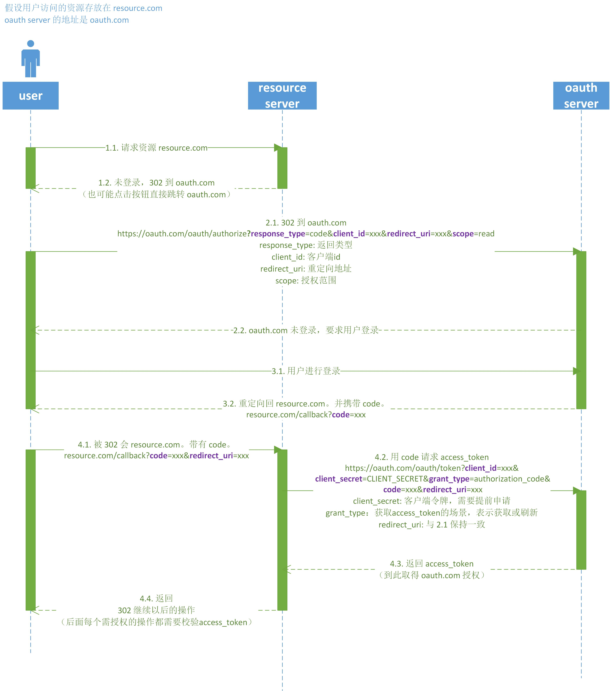
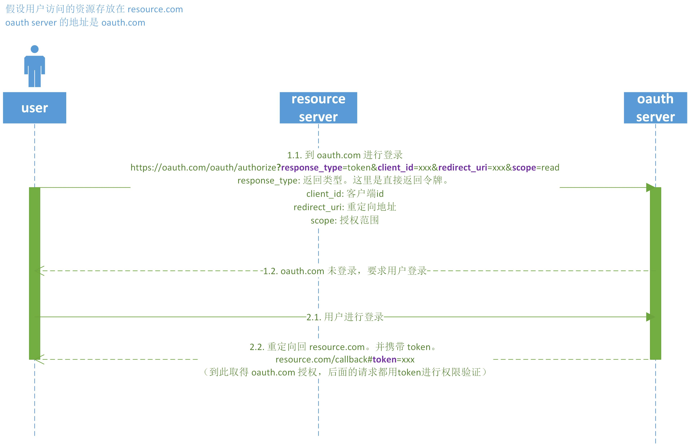

# OAuth2

<https://www.rfc-editor.org/rfc/rfc6749>

## 授权码式

最常用的流程，安全性最高。



## 隐藏式

纯前端流程，直接向前端发送令牌（access_token），没有授权码（code）。



## 密码式

如果 oauth server 高度信任某个应用，也可以采用密码式。

```
https://oauth.com/token?grant_type=password&username=xxx&password=xxx&client_id=xxx
```

## 凭证式

针对应用的授权，而不是针对用户的授权。

```
https://oauth.com/token?grant_type=client_credentials&client_id=xxx&client_secret=xxx
```
